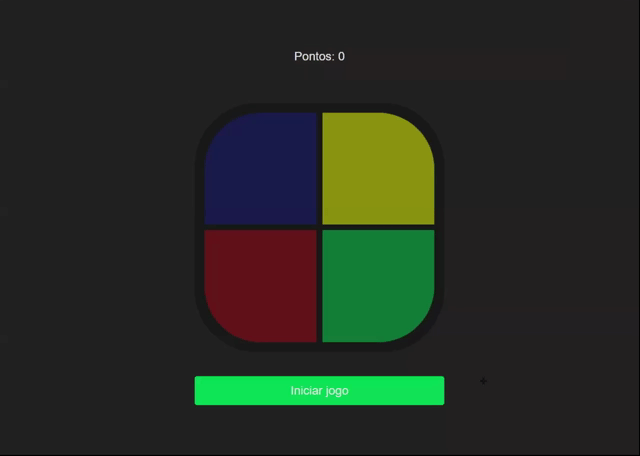

<p align="center">
  <a href="https://www.linkedin.com/in/thsthiago-cabral/">
    
  </a>

</p>

<h1 align="center">Jogo Genius</h1>

<p align="center">
 <a href="#-sobre-o-projeto">Sobre</a> •
 <a href="#-layout">Layout</a> • 
 <a href="#-como-executar-o-projeto">Como executar</a> • 
 <a href="#-tecnologias">Tecnologias</a> • 
 <a href="#-autor">Autor</a> • 
 <a href="#user-content--licença">Licença</a>
</p>

## 💻 Sobre o projeto

Genius é um jogo de memória com 4 grandes botões que acendem em uma sequência aleatória que vai se tornando mais longa a cada rodada. O jogador deve repetir a sequência pressionando os botões na ordem correta.

---

## 🎨 Layout

### Web

<p align="center">
  
</p>

---

## 🚀 Como executar o projeto

### Pré-requisitos

- [x] [Git](https://git-scm.com)

### 🧭 Rodando o projeto

```bash

# Clone este repositório
$ git clone https://github.com/thsthiago/jogo_genius.git

# Acesse a pasta jogo_genius no seu editor de código

```

---

## 🛠 Tecnologias

As seguintes ferramentas foram usadas na construção do projeto:

- **JavaScript**
- **HTML**
- **CSS**

---

## 👨🏽‍💻 Autor

 
 <br />
 <sub><b>Thiago Cabral</b></sub></a>
 <br />

[](https://www.linkedin.com/in/thsthiago-cabral/)
[](mailto:thiagocabral477@gmail.com)

---

## 📝 Licença

Este projeto esta sobe a licença [MIT](./LICENSE).

Feito com ❤️ por Thiago Cabral 🚀
